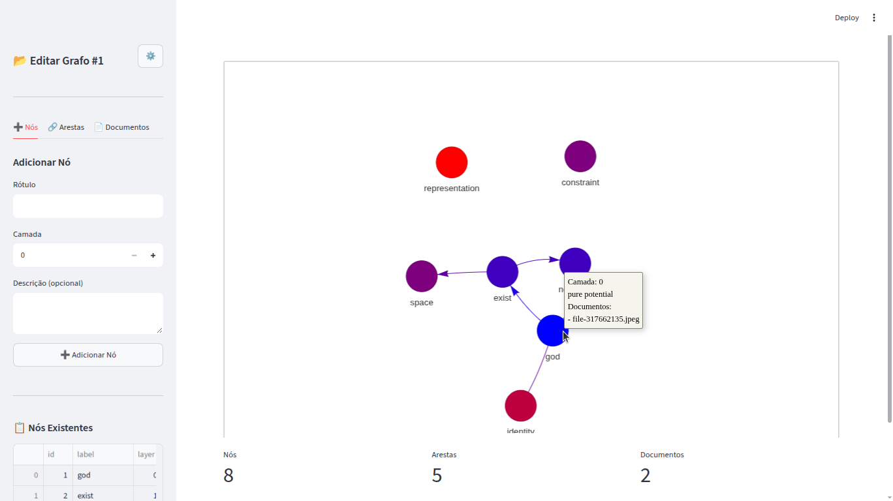

# Vigra - Visualizador de Grafo



> Visualizador simples de grafos construído com Streamlit e Pyvis.

Características:
- Criar/abrir/deletar múltiplos grafos
- Adicionar, editar e excluir nós e arestas
- Anexar documentos a nós/arestas
- Visualização interativa com cores em gradiente por camada

Como executar localmente:

1. Crie e ative um ambiente virtual (recomendado):

```bash
python3 -m venv .venv
source .venv/bin/activate
```

2. Instale dependências:

```bash
pip install -r requirements.txt
```

3. Rode a aplicação:

```bash
streamlit run app.py
```

Aplicação construída com IA.


